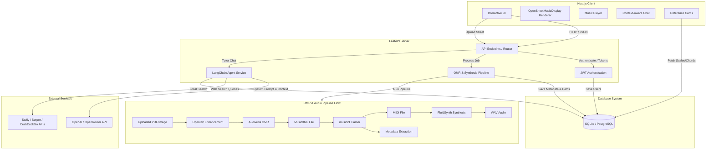

# TrebleAI — AI-Powered Music Theory & Practice Platform

<p align="center">
  
  
  
  
  
  
</p>

TrebleAI is a premium, full-featured music theory learning and sheet music practice application. It combines a modern Next.js client with a robust FastAPI backend to help musicians practice sheet music, analyze notation, and receive real-time, context-aware guidance from an AI music tutor.

---

## 🎯 Key Features

### 🎵 Practical Practice Page
* **Sheet Music Uploader**: Interactive drag-and-drop interface supporting PDF and MusicXML/MXL files.
* **Dynamic Notation Rendering**: High-fidelity, vector-based sheet music rendering powered by OpenSheetMusicDisplay (OSMD).
* **Interactive Player**: Custom playback speed (0.5x - 2.0x) and volume controls for synthesized audio play-along.
* **Context-Aware AI Chat**: Talk to an AI tutor who knows exactly which sheet music you are practicing, its key signature, tempo, and composer, giving you tailored advice and study recommendations.

### 🎓 Theory Assistant
* **Immersive Chat Space**: A full-screen study interface with a beautiful glassmorphism design and custom floating background animations.
* **Dynamic Study Titles**: Conversational chat sessions are automatically summarized into concise, academic music-study titles using LLMs.
* **Suggested Study Prompts**: Instant prompts to quickly explore topics like modal harmony, cadences, voice leading, and chord construction.

### 📚 Reference Library
* **Searchable Database**: Quickly search scales, chords, and musical notes stored in a relational database.
* **Visual Information Cards**: Interactive cards that expand to show note spelling, mathematical scale formulas, interval configurations, and structural metadata.

### 🔐 User Management & Security
* **JWT-Based Authentication**: Secure login/registration using Access and Refresh tokens with automated token versioning to support instant session invalidations.
* **Password Hashing**: Secure storage via `argon2-cffi` / `bcrypt` algorithms.

---

## ⚙️ Core Architecture & Pipeline

TrebleAI features a advanced sheet music processing pipeline. When a user uploads a sheet music image or PDF, the backend automatically converts it into interactive notation, parses its musical qualities, and synthesizes playable audio:



### OMR & Audio Pipeline Breakdown
1. **Enhancement**: OpenCV processes uploaded images (grayscale conversion, adaptive thresholding, deskewing) to optimize readability. PyMuPDF renders PDF pages to crisp images.
2. **OMR (Optical Music Recognition)**: Audiveris processes the image to output a MusicXML (`.mxl`) file.
3. **Parsing**: `music21` inspects the XML structure to extract metadata (tempo, key signatures, active accidentals, time signature).
4. **Synthesis**: `music21` compiles the score into standard MIDI, which FluidSynth synthesizes into standard WAV audio using a high-quality GeneralUser SoundFont.

---

## 🛠️ Tech Stack

### Backend
* **Web Framework**: FastAPI (Python 3.10+)
* **Database & ORM**: SQLAlchemy 2.0 (SQLite for development, supports PostgreSQL)
* **Agentic AI**: LangChain (LangChain OpenAI / LangChain Core)
* **Image Processing**: OpenCV & PyMuPDF (fitz)
* **Music Analysis**: `music21`
* **OMR Software**: Audiveris OMR Engine
* **Audio Synthesizer**: FluidSynth & GeneralUser SoundFont

### Frontend
* **Framework**: Next.js 16 (App Router, TypeScript)
* **Styling**: Tailwind CSS 4.0
* **UI Components**: shadcn/ui & Radix primitives
* **Animations**: Tailwind Animate & CSS custom animations
* **Sheet Music Display**: OpenSheetMusicDisplay (OSMD)
* **State & APIs**: Axios & Vercel AI SDK

---

## 🚀 Quick Setup & Installation

### Prerequisites
* **Python** (version 3.10 or higher)
* **Node.js** (version 18 or higher)
* **pnpm** (preferred) or **npm**
* **Audiveris OMR** (Required for PDF/Image processing: [Install Audiveris](https://github.com/Audiveris/audiveris))
* **FluidSynth** (Required for MIDI synthesis: [Install FluidSynth](https://github.com/FluidSynth/fluidsynth/releases))

---

### Step 1: Clone and Prepare Workspace
```bash
git clone https://github.com/CherishVasant/Treble-AI.git
cd Treble-AI
```

### Step 2: Configure Backend Environment
1. Navigate to the backend folder:
   ```bash
   cd backend
   ```
2. Create virtual environment and install dependencies:
   ```bash
   python -m venv venv
   # On Windows:
   .\venv\Scripts\activate
   # On macOS/Linux:
   source venv/bin/activate

   pip install -r requirements.txt
   ```
3. Set up your environment variables by copying `.env.example` to `.env`:
   ```bash
   cp .env.example .env
   ```
4. Update the variables inside `.env`:
   * Set your `DATABASE_URL` (defaults to SQLite if left empty).
   * Put your `OPENAI_API_KEY` or `OPENROUTER_API_KEY`.
   * (Optional) Configure custom local binary paths for `AUDIVERIS_PATH` or `FLUIDSYNTH_PATH` in `config.py` / `pipeline.py` if they are not in your system environment PATH.

---

### Step 3: Configure Frontend Environment
1. Navigate to the frontend folder:
   ```bash
   cd ../frontend
   ```
2. Install dependencies:
   ```bash
   pnpm install
   # Or using npm:
   npm install
   ```
3. Configure frontend environment variables:
   ```bash
   cp .env.example .env.local
   ```
4. Update `OPENAI_API_KEY` or `NEXT_PUBLIC_APP_URL` in `.env.local` as needed.

---

## 🏃 Running the Application

### Option A: Using the Automatic Startup Scripts (Windows)
We provide easy launcher scripts at the root directory:
* **Batch Script**: Double click `start.bat` or run:
  ```cmd
  .\start.bat
  ```
* **PowerShell Script**: Run:
  ```powershell
  powershell -ExecutionPolicy Bypass -File start.ps1
  ```

### Option B: Manual Startup

1. **Start the FastAPI Backend**:
   ```bash
   cd backend
   # Ensure your virtual environment is active
   python main.py
   ```
   The backend will be running at `http://localhost:8000`.

2. **Start the Next.js Frontend**:
   ```bash
   cd frontend
   pnpm dev
   # Or using npm
   npm run dev
   ```
   The client application will be running at `http://localhost:3000`.

---

## 📁 Repository Directory Layout

```
Treble-AI/
├── backend/
│   ├── routers/             # API Router endpoints (Auth, Chats, Reference, Theory)
│   ├── services/            # Shared business logic and LangChain services
│   ├── soundfonts/          # GeneralUser-GS SoundFont file for MIDI playback
│   ├── database.py          # SQLAlchemy engine, session maker, and DB base model
│   ├── main.py              # Application entry point, lifespan, CORS, and root endpoints
│   ├── models.py            # SQLAlchemy schema models (Users, Chats, PracticeSessions)
│   ├── pipeline.py          # OMR, MusicXML parsing, MIDI conversion & FluidSynth audio synthesis
│   ├── seed.py              # Startup database seed scripts for the Reference library
│   └── requirements.txt     # Python libraries list
├── frontend/
│   ├── app/                 # Next.js App Router (Layouts, Pages, APIs)
│   ├── components/          # Reusable React components (Player, OSMD Viewer, AIChat)
│   ├── context/             # React Context providers (AuthContext, ThemeContext)
│   ├── styles/              # CSS theme and custom animation variables
│   └── package.json         # Node.js dependencies configuration
├── start.bat                # Windows quick launcher batch file
├── start.ps1                # Windows quick launcher PowerShell script
└── requirements.txt         # Root-level requirements redirection
```

---

## 📜 License
This project is licensed under the MIT License. Feel free to use, modify, and distribute it as you wish.

---
*Built with ❤️ by [Cherish Vasant](https://github.com/CherishVasant)*